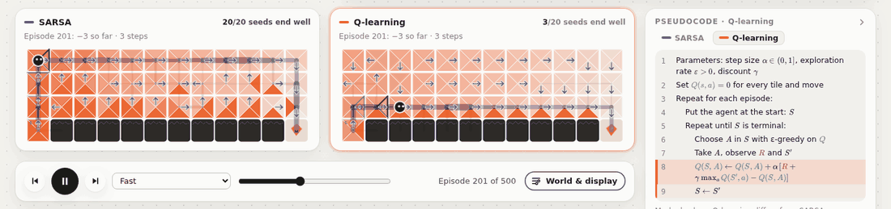
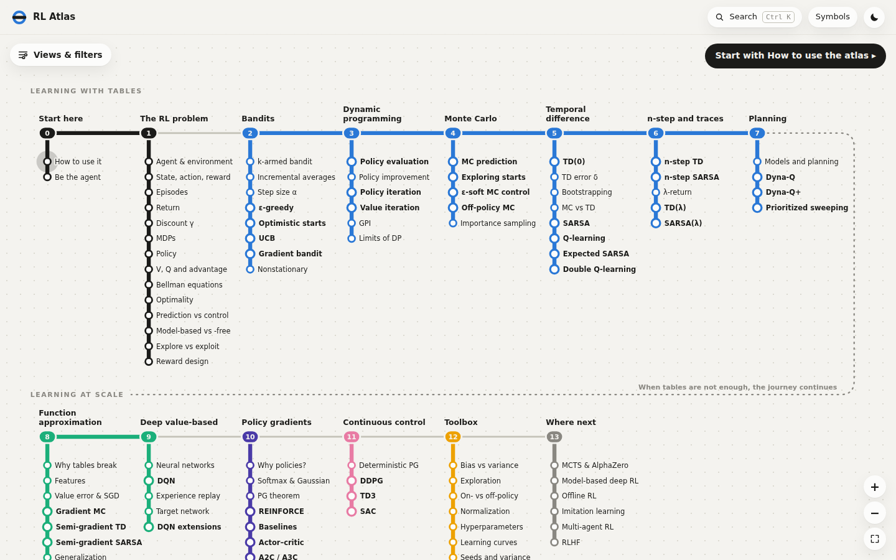
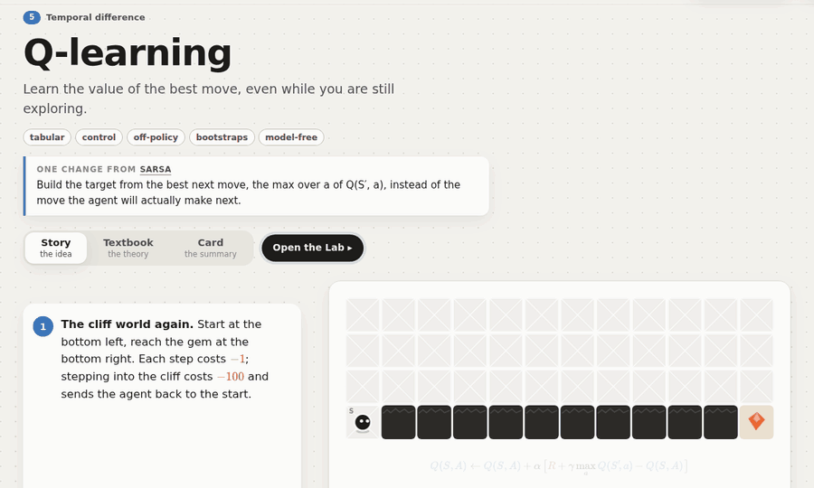
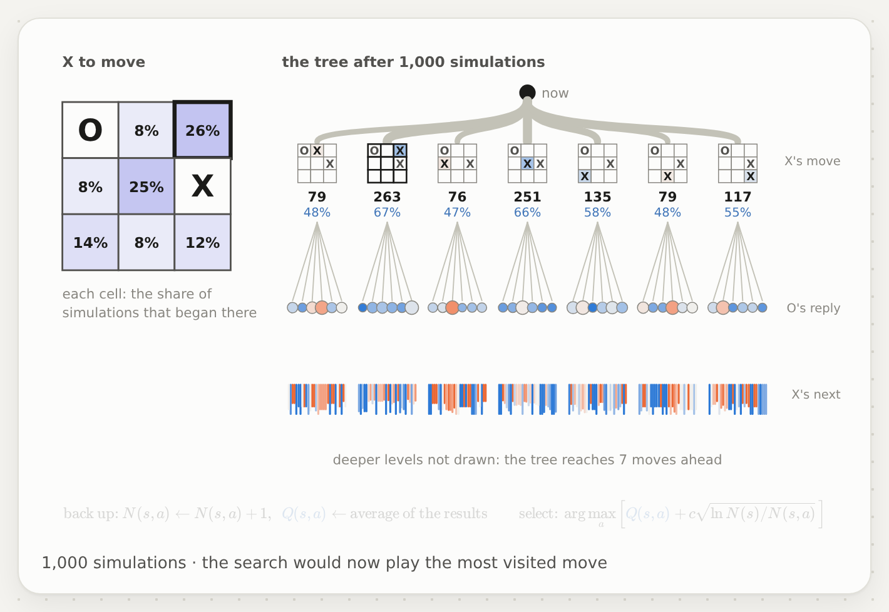
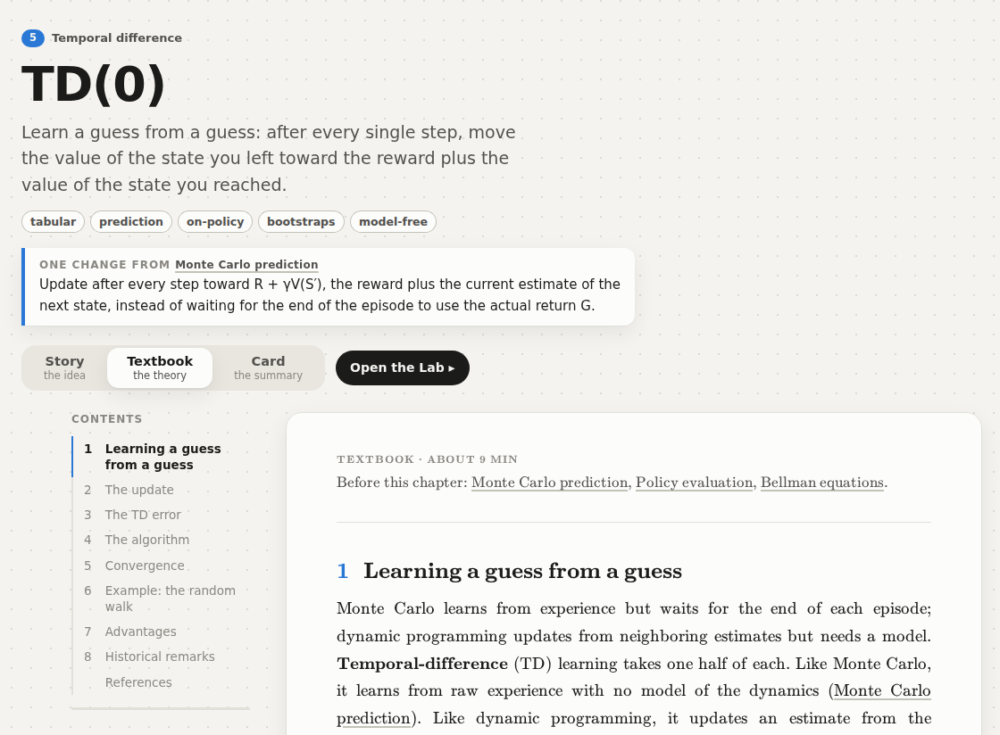
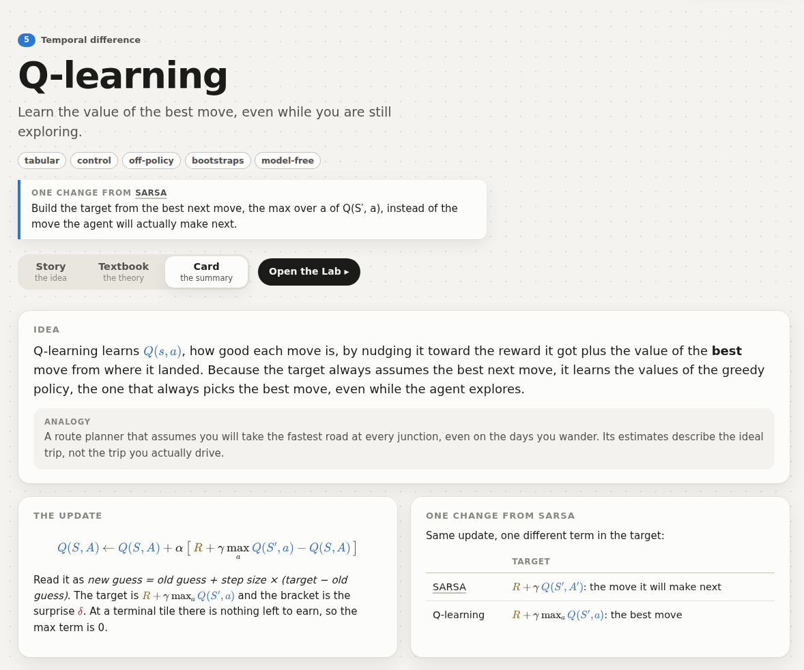
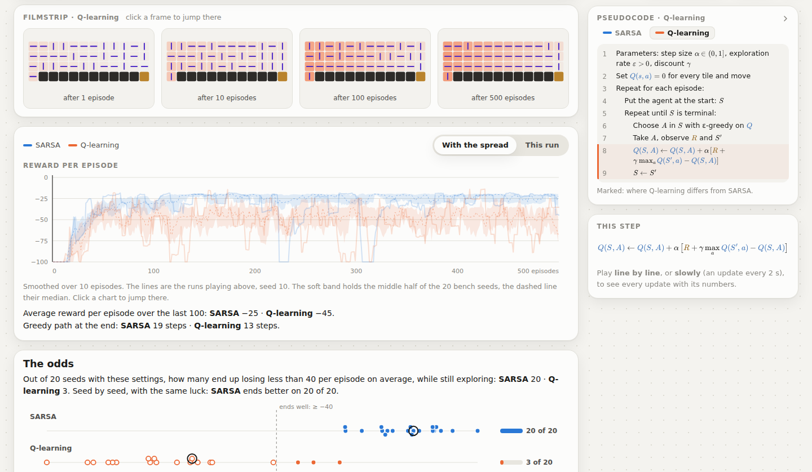
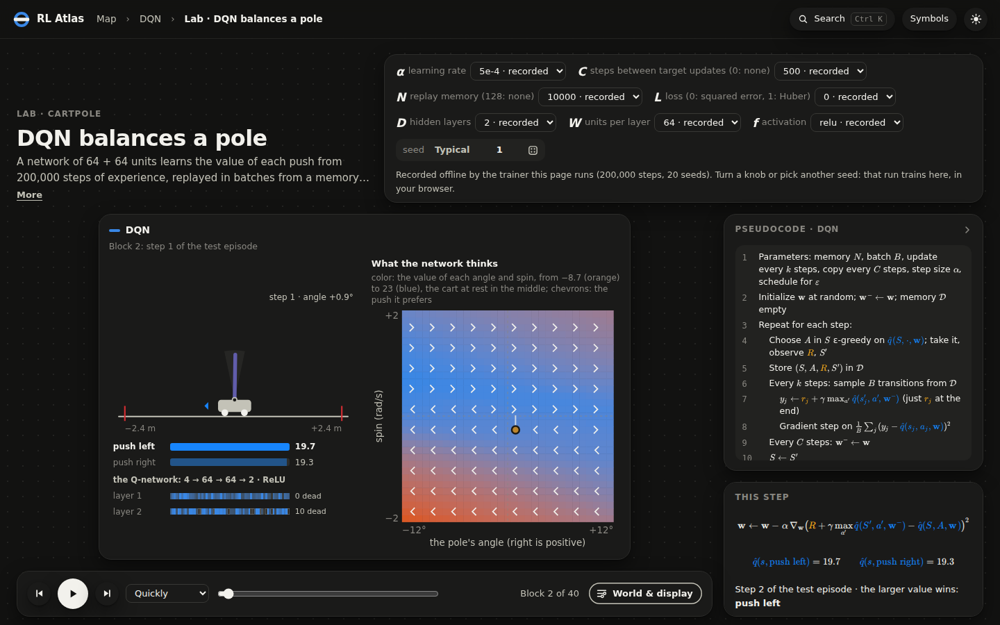

<h1 align="center">RL Atlas</h1>

<p align="center">
  <b>A visual, interactive guide to reinforcement learning</b><br>
  from the agent–environment loop to PPO and SAC, and on to where the field goes next.<br>
  One HTML file that works offline, with nothing to install.
</p>

<p align="center">
  <a href="https://github.com/DrippingSoup22/rl_atlas/releases/latest/download/rl_atlas.html"><b>Download rl_atlas.html</b></a>
  &nbsp;·&nbsp;
  <a href="https://github.com/DrippingSoup22/rl_atlas/releases/latest">Release notes</a>
</p>

<p align="center">
  
  <br>
  <sub>SARSA and Q-learning on the cliff after 200 episodes: the same world, the same luck, one change in the update.
  SARSA keeps to the safe path along the top; Q-learning walks the edge.</sub>
</p>

Reinforcement learning is easier to understand when you can watch it happen. RL Atlas puts a moving picture next to
every idea, takes every number it quotes from a real run, and lets you race the algorithms against each other right in
your browser.

- **95 stations in 14 parts**: the core of Sutton & Barto's *Reinforcement Learning: An Introduction*, then deep RL,
  a toolbox for real experiments, and where the field goes next.
- **Three ways to read every algorithm**: a story, a textbook chapter and a one-page card.
- **58 experiments in the Lab**, from one pseudocode line at a time to 50 episodes a second, with the odds over 20 seeds.
- **Deep RL that runs in the page**: networks trained by the guide's own JavaScript trainer.
- **Private and offline**: one 8 MB file, no server, no account. Your progress stays in your browser.

## A quick tour

### The map



Every station is one idea, in reading order: the agent–environment loop, bandits, dynamic programming, Monte Carlo,
temporal difference, n-step methods and traces, planning, function approximation, deep value methods, policy
gradients, continuous control, the toolbox, and where next (MCTS and AlphaZero, offline RL, imitation, RLHF). The
stations you have read fill with color. Two more views draw a family tree for each line, and every algorithm on Sutton
& Barto's unified map.

### Stories



Scroll the text and the picture follows, one step at a time: an agent takes its first steps, a value changes, a policy
settles. There are 79 stories. Their runs are picked because they make their point clearly, and the Lab shows how
typical they are.



### Textbook and card

<table>
  <tr>
    <td width="50%"></td>
    <td width="50%"></td>
  </tr>
</table>

The **textbook** is the theory, like a book chapter: definitions, derivations, theorems, figures recomputed live by the
Lab, and references. The **card** is the summary on one sheet: the idea, the update, the pseudocode, perks and flaws,
the knobs, and quiz questions.

### The Lab



Race algorithms on the same world with the same luck and watch them learn: one pseudocode line at a time, with every
number of the update, or fast enough to see 500 episodes go by. Under the race come a filmstrip, the curves with the
spread of 20 seeds, and the odds: how often each one's settings end well, and how those odds move when you turn a knob.
**Change world** moves an experiment to Frozen Lake, Taxi, the windy gridworld, CartPole, Acrobot and more, and the
pseudocode column folds away for a bigger view.

### Deep RL, in the browser



DQN and its extensions, A2C, TRPO and PPO on CartPole, and PPO, DDPG, TD3 and SAC on Pendulum, each recorded over 20
seeds by the guide's own JavaScript trainer. Play back any seed, see what the network thinks of every state, or turn a
knob and train a new run in the page.

## Use it

[Download `rl_atlas.html`](https://github.com/DrippingSoup22/rl_atlas/releases/latest/download/rl_atlas.html) and
open it in a browser (it is developed and tested with Chromium, the engine of Chrome, Edge and Brave). The home screen
is the map. It has three views (the metro map in reading order, a tree per line of what builds on what, and Sutton &
Barto's unified view with every algorithm placed) and filters by label, in a side panel opened by **Views & filters**
at the top left (or `V`). Drag to move and Ctrl + scroll to zoom; the map always stays in view.
Each algorithm can be read three ways, in this order, and then watched:

- **Story**: the idea. Scroll the text, and the picture follows it step by step.
- **Textbook**: the theory, like a book chapter: definitions, derivations, theorems, figures and references.
- **Card**: the summary: the formula, pseudocode, perks, flaws, knobs and questions on one sheet.
- **Lab**: watch it learn, one pseudocode line at a time or 50 episodes per second, and see how often its
  settings end well over many runs, and how those odds move with each knob. The world and the display options sit
  in a drawer opened by **World & display** in the play bar (Esc closes it); the arrow at the top of the pseudocode
  folds that column into a tab at the edge.

Hover any colored symbol to light up every symbol of its kind; hover any underlined term for a short
explanation. `Ctrl K` searches the whole atlas, **Symbols** lists every symbol the guide uses, and the button at the
top right switches to the dark theme.

## Build and check

```
python build.py
node --test
```

`build.py` (Python 3.11+, standard library only) checks `content/`, writes `app/content.js`, `app/recordings.js`,
`app/deep-worker.js` and `app/story-curves.js`, and bundles `rl_atlas.html`. It stops on broken links and lists what
is still missing. `node --test` (Node 22+) checks the Lab against the textbook results it teaches. After a build,
`app/index.html` also opens directly, which is handier while editing.

The generated files are committed with their sources, so build before committing. `main` is always the guide
as it stands, and every commit on it builds with no warnings and passes the tests. Work is committed straight to
`main` in such steps. A branch, when one is needed, is short-lived: it ends merged into `main` and deleted, or just
deleted.

A release is a tag on `main`. Write its notes in `docs/releases/<tag>.md`, then tag and push:

```
git tag -a v1.0.0 -m "RL Atlas 1.0.0"
git push origin v1.0.0
```

The release workflow (`.github/workflows/release.yml`) builds the page from the tagged sources, checks that it matches
the committed `rl_atlas.html`, runs the tests, and publishes the release with `rl_atlas.html` as its download. It also
runs by hand (Actions → Release → Run workflow, on `main`) with the version to publish, and then makes the tag itself.

## Folders

| Folder | What is in it |
| --- | --- |
| `content/` | `map.toml` (every station in reading order, with each algorithm's parent and labels), `lab.toml` (Lab presets), `notation.toml` (symbols page), one Markdown file per written entry, `recordings/` (what the recorder wrote) and `story-curves.json` (the story charts' averages, worked out offline) |
| `app/` | the page: `index.html`, `css/` and `js/` (shell, map, pages, stories and their scenes, textbook, diagrams, figures, demos, math), and the generated `content.js`, `recordings.js`, `deep-worker.js` and `story-curves.js` |
| `lab/` | worlds, features, algorithms, runs (computed live, or played back from recordings) and dynamic programming (no DOM, also used by the tests), and their views; `lab/deep/` is the trainer of the networks (deterministic math, so a seed gives the same run in Node and in any browser), which the page also runs in a Web Worker for seeds and settings off the recordings |
| `vendor/` | KaTeX 0.19 (MIT license) |
| `tests/` | `lab.test.js`, `deep.test.js`, `recordings.test.js` and `stories.test.js` (the pinned story runs, and the story charts' averages against the engine) |
| `tools/` | `story-runs.js` (how each story run's seed compares with others) and `story-curves.js`, which works out the story charts' averages (up to 100 runs a curve) once, so that the page shows them at once: run it after changing a story's runs or the engine, then build (`stories.test.js` says when) |
| `recorder/` | the recorders of the runs with neural networks. `node recorder/deep.js [name …]` trains with `lab/deep/`, one thread per core, resumable (`recorder/.cache`), and `--sweep` makes the sweeps. The older NumPy recorder (NumPy 2.4 and Gymnasium 1.4) stays as a cross-check: `python recorder/record.py [name …]` trains 20 seeds and writes `content/recordings/<name>.json` (every seed's training and test returns, and one seed's snapshots), and `--sweep` writes `content/recordings/sweeps/<name>.json` (each knob's values over many seeds); `build.py` bundles both. `RECORDINGS_OUT` sends them elsewhere, to compare before replacing |
| `docs/` | the README's pictures (`images/`) and each release's notes (`releases/`) |
| `.github/` | the release workflow |

## Writing an entry

An entry is `content/<part folder>/<id>.md`, where `<id>` is a station in `map.toml`. It starts with TOML
front matter between `+++` lines: `summary`, `change` (what changed from the parent), `prereqs`, `lab`, `sources`,
`story_in` (for an entry without a story of its own: the stations whose stories show its idea at work),
and for a story a `[story]` table: its scene (`grid`, `loop`, `timeline`, `mdp`, or one of the Lab's views: `bandit`,
`chain`, `cards`, `graph`, `line`, `car`, `star`, `corridor`, `throw`, `cartpole`, `pendulum`), the scene's settings, and a formula whose pieces are wrapped in `\step{n}{…}`. Scenes on
a Lab view, and grid stories that replay dynamic programming or Monte Carlo, name their runs in a `[story.runs]`
table (`name = { algorithm, <knobs> }`, or `name = { recording }` for a run trained offline); a step then picks a run and a moment (`run`, `at`), can replay some units
(`play`, `pace`), or only the first few updates of one (`updates`; with `instant`, without animation, to jump to a moment inside a unit), or hold a few moments of the run in turn (`checkpoints`, a list of units
or a count for evenly spaced ones; `hold`, in milliseconds), and can chart runs averaged over many seeds (`curves`,
`metric`, `domain` to fix the range, `log` for a log axis, `ref = [value, "label"]` for a reference line and `title` for a title of its own). Grid steps can paint a batch's advantages on the move triangles (`advantages`),
and a `[story.numbers]` table names lines of numbers that steps show under the formula (`numbers = "name"`).
A story runs on a seed picked because it proves its point clearly; how often settings succeed over many seeds is
the Lab's job. Every number in a story comes from its runs.
[q-learning.md](content/05-temporal-difference/q-learning.md) is a complete algorithm,
[bellman.md](content/01-problem/bellman.md) a complete concept, and [epsilon-greedy.md](content/02-bandits/epsilon-greedy.md)
a story on Lab runs.

The body has up to three parts: a `## Story` made of `::: step {…}` blocks (the braces say what the picture
shows), a `## Textbook` and a `## Card`, both made of `###` sections. On top of plain Markdown you can use:

- `[[station]]` or `[[station|text]]` for links that explain themselves on hover, and `[text](lab:preset)` for Lab links;
- `$…$` and `$$…$$` math with the color macros `\val \rew \pol \err` and `\alp \gam \eps \lam \del`;
- `{{demo arg}}` for a diagram, figure or demo: `backup` (bandit, mc, mc-q, td0, sarsa, q-learning, expected-sarsa,
  double-q, ddpg, td3, sac, n-step-td, n-step-sarsa, lambda, lambda-q, v-pi, q-pi, v-star, q-star, reinforce, baseline, actor-critic, a2c, gae), `gridworld` (random, optimal), `cliff-paths`, `cliff-curves`, `cliff-alpha`,
  `loop`, `mdp-graph` (robot), `discount`, `be-the-agent`, `testbed`, `sample-average`, `step-weights`, `step-sizes`,
  `bandit-curves` (epsilon, optimistic, ucb, gradient, drift), `bandit-study`, `dp-sweeps`, `frozen` (pi, optimal),
  `dp-race`, `gpi`, `blackjack-values`, `blackjack-policy`, `blackjack-match`, `frozen-mc`, `is-blackjack`,
  `is-infinite`, `random-walk` (values, error, batch), `max-bias`, `n-step-study`, `lambda-study` (offline, online),
  `lambda-weights`, `trace-shapes`, `n-step-paths` (lambda), `dyna-architecture`, `dyna-curves`, `dyna-midway`,
  `changing-maze` (blocking, shortcut), `expected-vs-sample`, `sweeping-curves`, `touch-tiles`, `feature-shapes`,
  `coarse-widths`, `walk-fit` (mc), `walk-alpha`, `walk-n-study`, `basis-study`, `tiling-study`, `car-surfaces`, `car-curves` (n),
  `baird-weights`, `corridor-values`, `softmax-play`, `gaussian-play`, `pg-estimates`, `reinforce-alpha`, `baseline-curves`,
  `critic-speed`, `entropy-study`, `gae-weights`, `gae-study`, `trust-region` (clip), `ppo-clip`. A backup label breaks into lines at `\n`, and
  a display formula too wide for its column shrinks a little, then stacks the parts written side by side with `\qquad`;
- `::: pseudocode` (end a line with `{#id}` to link it to the Lab's step-by-step mode), `::: question` (answer after `---`) and `::: analogy`.

The Textbook numbers its sections, figures and statements, and any display equation with a `\label{name}`;
`\ref{name}` links to them (§2, (3), Figure 1, Theorem 1). Its blocks are `::: definition`, `theorem`, `lemma`,
`example` (all written `::: kind {#name} Title`), `remark`, `proof` (`::: proof Proof idea` renames it),
`::: figure {#name}` (a `{{demo}}` line, then the caption) and `::: algorithm {#name} Title` (pseudocode lines).

## Credits

The core of the guide follows Richard S. Sutton and Andrew G. Barto's *Reinforcement Learning: An Introduction*
(2nd edition, 2018), retold in the guide's own words with its own pictures; the deep RL and later parts follow the
papers each entry cites. CartPole, Acrobot and Pendulum port [Gymnasium](https://gymnasium.farama.org/)'s equations,
and the math is typeset by [KaTeX](https://katex.org/).

## License

[MIT](LICENSE). KaTeX, in `vendor/katex/`, keeps its own MIT license.
